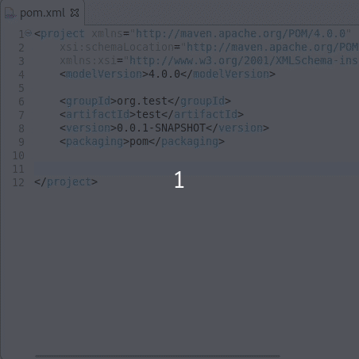

# LemMinX-Maven

_Want to provide some powerful Maven pom edition support in your software without pain? Search no more!_

This project is an [Eclipse LemMinX](https://github.com/eclipse/lemminx) (XML Language Server) extension to provide some extra assistance to edition of Maven POM files

  <a href="https://mickaelistria.github.io/redirctToEclipseIDECloneCommand/redirect.html"></a>  

## Features

Additionally to the XSD based assistance provided by LemMinX when editing pom files, this extension adds:

- model error reports are diagnostics
- completion and hover documentation for `dependency/scope` (test, provided, runtime, ...)
- completion and hover documentation for `plugins/execution/phase` (process-resources, package, test, verify...)
- completion and hover for GAVs or any groupId, artifactId, version item under `depedencies`, `dependency`, `plugins`, `plugin`, `parent`
- completion and hover evaluation for properties
- completion, hover documentation and validation for plugins `configuration` elements
- results use local repository and remote repositories (with index)

Here a demo in Eclipse IDE:



## Consuming LemMinX Maven

Get the maven artifact from the Eclipse Nexus repository

```xml
...
	<groupId>org.eclipse.lemminx</groupId>
	<artifactId>lemminx-maven</artifactId>
	<version>0.0.1-SNAPSHOT</version>
...
	<repositories>
		<repository>
			<id>lemminx-releases</id>
			<url>https://repo.eclipse.org/content/repositories/lemminx-releases/</url>
			<snapshots>
				<enabled>false</enabled>
			</snapshots>
			<releases>
				<enabled>true</enabled>
			</releases>
		</repository>
		<repository>
			<id>lemminx-snapshots</id>
			<url>https://repo.eclipse.org/content/repositories/lemminx-snapshots/</url>
			<snapshots>
				<enabled>true</enabled>
			</snapshots>
			<releases>
				<enabled>false</enabled>
			</releases>
		</repository>
	</repositories>
```

Then, just start the LemMinX Language Server as documented on the LemMinX documentation, and make sure the LemMinX-Maven extension is in the classpath. If done correctly, then whenever LemMinX starts processing some `pom.xml` file, the LemMinX-Maven extension should automatically participate as well.

## Integrations

### Eclipse IDE

This extension is already used from the "Generic Text Editor" in Eclipse 4.16+ when [Eclipse m2e is installed](https://github.com/eclipse-m2e/m2e-core/blob/master/README.md#-installation).

### VSCode

This extension is installed with [vscode-xml-maven](https://github.com/angelozerr/vscode-xml-maven). Read [here](https://github.com/redhat-developer/vscode-xml#custom-xml-extensions) for further explanation on how it works.

## Demos and other resources

Coming soon...
