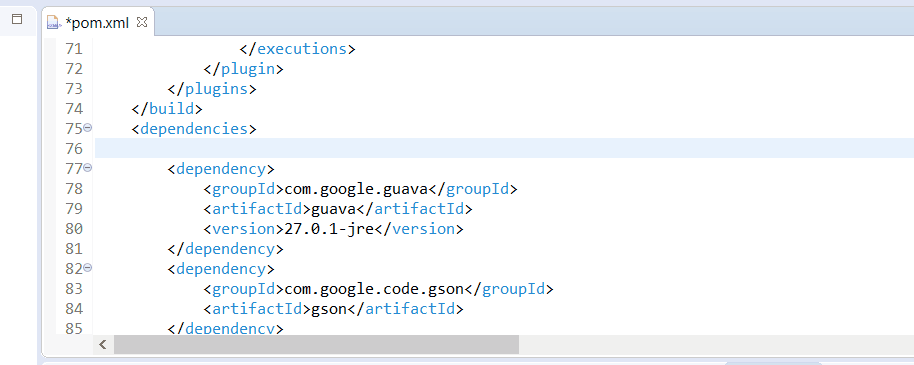
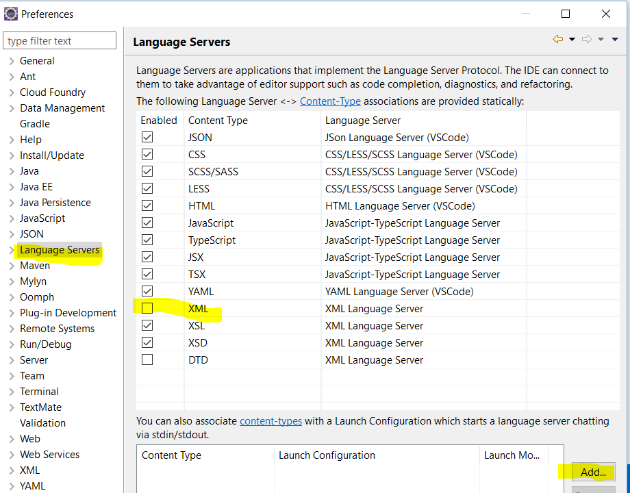
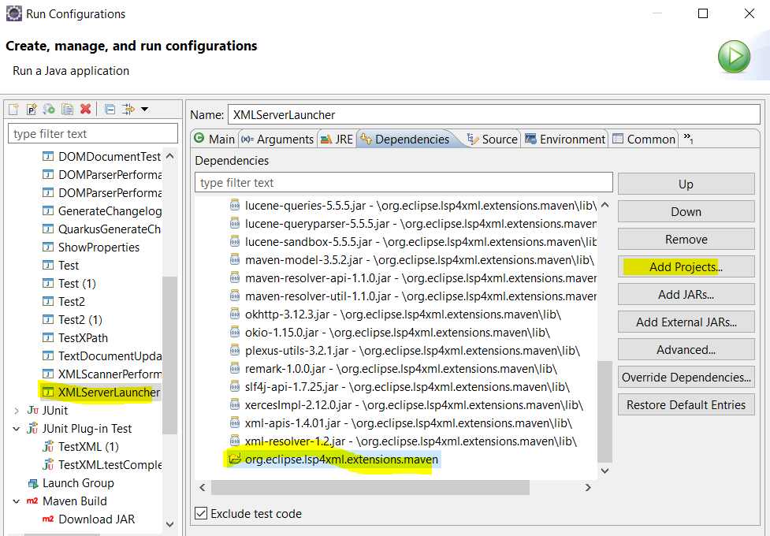

# LemMinX-Maven

This project is an Eclipse LemMinX (XML Language Server) Extension for Maven. It provides :

- completion for:
  - dependency/scope (test, provided, runtime, etc)
  - dependency snippet to generate dependency and artifactId, groupId, version XML content. This snippet is available only if completion is triggered inside a dependencies element.
  - completion for groupId (it uses local repository but it must be improved a lot.

TODO: the project is a POC, we should add a lot of features.

Here a demo with LSP4E:



# Integration

## vscode

Use [vscode-xml-maven](https://github.com/angelozerr/vscode-xml-maven) and read [here](https://github.com/redhat-developer/vscode-xml#custom-xml-extensions) for more explanation how it works.

## Eclipse IDE

Install Wild Web Developer which provides XML support by consuming LSP4XML.

# Goal of this project

## Maven support as LS

Although :

- Eclipse IDE m2e provides a great support for Maven.
- [vscode-maven](https://github.com/microsoft/vscode-maven) provides a great support for Maven.

Both don't support LSP. IMHO it should be better to provide a maven support as Language Server to share maven features between Eclipse IDE, vscode and other IDE/Editor (atom, Sublime, etc) which support LSP.

I think lsp4xml-extensions-maven should consume m2e (core and not the ui plugins):

- with JDT LS for vscode context.
- with JDT for Eclipse IDE.

To do that, the LSP4XML maven extension (which belongs to a language server) must delegate the call of JDT / m2e to her LSP language client:

- in vscode context, the TypeScript language client will delegate the call of JDT / m2e by JDT LS (by executing a java workspace command and by a custom LSP services if one day it will be available) .
- in Eclipse IDE, the LSP4E language client should call a service class which call the JDT / m2e. This feature is not supported for the moment by LSP4E (see more explanation in the following section).

A sample of call of JDT / m2e feature is to support completion for artifactId which requires m2e settings. See JDT LS extension

## Improvement TODO

### On Eclipse LemMinX

For some features, like completion for groupId, artifactId, version (let's call this feature `searchArtifact`), LSP4XML maven extension must delegate this search by JDT / m2e (vscode-maven provides already this support with JDT LS delegate command handler that we could re-use it). The first idea that we have is `let's LSP4XML maven extension communicate with JDT / m2e` but it's a bad idea:

- it will work on Eclipse IDE context but not with other context:

  - in vscode context, the call of JDT / m2e is done by the vscode-xml-maven language client by executing a java workspace command. The LSP4XML extension should call this language client.
  - in IJ context, IJ provides their own Maven support which is not based on m2e.

In other words to support any context (vscode, IJ, Eclipse IDE, etc) the LSP4XML maven extension must use his Java language client instance created by the XML Language Server and call a custom LSP service (ex: LSP request `maven/searchArtifact`). This custom LSP request `maven/searchArtifact` must be implemented on LSP language client side:

- on vscode context, a java workspace command will be called to delegate the `maven/searchArtifact` request to the JDT LS.
- on Eclipse IDE, the Java language client for XML must support (but dynamically as LSP4XML maven extension is an extension) the `maven/searchArtifact` request.  

LSP4XML maven extension must consume the language client instance created by the LSP4XML launch XMLLangageServerLauncher. This feature is not supported. See [Consume custom LSP service on extension side issue](https://github.com/angelozerr/lsp4xml/issues/590)

### On Wild Web Developer

Wild Web Developer [org.eclipse.wildwebdeveloper.xml](https://github.com/eclipse/wildwebdeveloper/tree/master/org.eclipse.wildwebdeveloper.xml) doesn't support load of LSP4XML extension. See [this issue](https://github.com/eclipse/wildwebdeveloper/issues/266).

#### LSP4E & launch

Today if you wish execute the LSP4XML extension in Wild Web Developer without extra coden you can do it with launch. This method is very helpful if you wish to debug the LSP4XML or LSP4XML extension. To do that:

- import `org.eclipse.lsp4xml project` in your workspace
- import `org.eclipse.lsp4xml.extensions.maven` project in your workspace
- Do `Run As` with `org.eclipse.lsp4xml.XMLServerLauncher` class. It will create a new launch (you can stop the lauch).
- Go at `Window / Preferences` and select `Language Preferences`
- `Uncheck XML` and click on `Add` button



- `Associate` the `XML` content type with the `XMLServerLauncher` in debug mode (run mode is OK too).


- Update the `XMLServerLauncher` launch to add `org.eclipse.lsp4xml.extensions.maven` in the classpath:



- open a pom.xml, you should see completion on dependency/scope element (test, provided, etc)

#### vscode context

On vscode context, vscode-xml provides the capability to contribute to LSP4XML with custom LSP4XML extension, in other words you declare the JAR of custom extension in the `package.json` of vscode custom extension).

```json
"contributes": {
	"xml.javaExtensions": [
		"./jar/your-custom-xml-extension.jar"
	]
}
```

When Eclipse LemMinX XML Language server is started, the `your-custom-xml-extension.jar` is added in the classpath and the extension is loaded by using Java SPI. See [here](https://github.com/redhat-developer/vscode-xml#custom-xml-extensions) for more information.

#### Eclipse IDE context

##### Use OSGi

As Java SPI is used to load extension in LSP4XML, in Eclipse IDE context we can use OSGi support:

- LemMinX must become an OSGi bundle.
- LemMinX maven extension must become an OSGi fragment of the LSP4XML.
- Wild Web Developer [org.eclipse.wildwebdeveloper.xml](https://github.com/eclipse/wildwebdeveloper/tree/master/org.eclipse.wildwebdeveloper.xml) imports the LemMinX OSGI bundle instead of embeds the LemMinX JAR.

Here Pros and cons:

- Pros:
  - no extension point to do.
- Cons:
  - user cannot desactivate the installed extension (from a preferences pages).
  - user cannot add a new extension (from a preferences pages).
  - LemMinX should become an OSGi bundle (maven build is not simple and it takes time to build the OSGi with pax)

##### Generate proper classpath

Manage extension by building the proper classpath like in vscode context. To do that an extension point like `org.eclipse.wildwebdeveloper.xml.javaExtensions` must be implemented.

```xml
<extension point="org.eclipse.wildwebdeveloper.xml.javaExtensions">
	<javaExtension
		path="./jar/your-custom-xml-extension.jar"
		name="My custom extension"
		description="..."
		id="org.eclipse.lsp4xml.extensions.maven">
	</fileType>
</extension>
```

All JARs of javaExtension must be collected and added in the classpath
[here](https://github.com/eclipse/wildwebdeveloper/blob/3a6df42340cdcd156b4e8fd98b9822d620f673f1/org.eclipse.wildwebdeveloper.xml/src/org/eclipse/wildwebdeveloper/xml/XMLLanguageServer.java#L41)
like it's done in vscode-xml [here](https://github.com/redhat-developer/vscode-xml/blob/6a7db6eb6eff235ef80f5fe9b0dd0ce33c9f5fc2/src/javaServerStarter.ts#L42).

Here Pros and cons:

- Pros:
  - user can desactivate the installed extension (from a preferences pages).
  - user can add a new extension (from a preferences pages).
- Cons:
  - extension point to do.

### On LSP4E

It's not clear in my head yet but there will have an issue with on Eclipse IDE, the Java language client for XML must support (but dynamically as LSP4XML maven extension is an extension) the `maven/searchArtifact` request.
